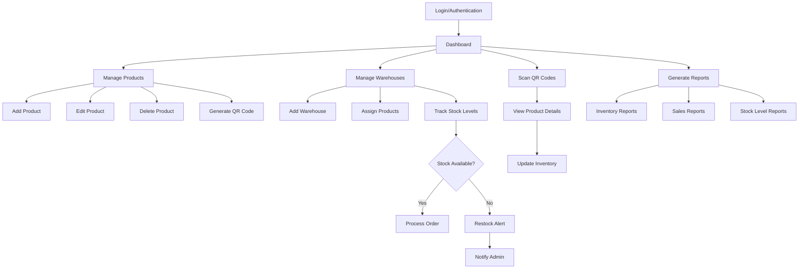

# Inventory Management System

This is a web-based inventory management system developed using Django.

## Features

- Add/edit/delete products
- Track stock levels
- Generate reports
- User authentication
- Real-time stock updates via WebSockets
- QR code scanning for inventory tracking
- Multi-warehouse management
- Supplier and customer management
- Order processing and tracking

## Project Flow



## Technologies Used

- Django 4.2.20
- Channels for WebSocket support
- PostgreSQL (production) / SQLite (development)
- Bootstrap for frontend styling
- Django Extensions
- Pillow for image processing
- QR Code generation
- ReportLab for PDF generation

## Installation

### Prerequisites

- Python 3.8 or higher
- pip (Python package manager)
- Git

### Setup Instructions

1. Clone the repository:

   ```
   git clone https://github.com/yourusername/inventory-management.git
   cd inventory-management
   ```

2. Create and activate a virtual environment:

   ```
   python -m venv env
   # On Windows
   env\Scripts\activate
   # On macOS/Linux
   source env/bin/activate
   ```

3. Install dependencies:

   ```
   pip install -r requirements.txt
   ```

4. Configure the database in `inventory_management/settings.py` (default is SQLite)

5. Run migrations:

   ```
   python manage.py migrate
   ```

6. Load initial data (optional):

   ```
   python manage.py loaddata inventory/categories.json
   ```

7. Create a superuser:

   ```
   python manage.py createsuperuser
   ```

8. Run the development server:

   ```
   python manage.py runserver
   ```

9. Access the application at http://127.0.0.1:8000/

## Project Structure

- `inventory/` - Main application directory
  - `models.py` - Database models for products, warehouses, etc.
  - `views.py` - View functions for handling requests
  - `forms.py` - Form definitions
  - `consumers.py` - WebSocket consumers for real-time updates
  - `routing.py` - WebSocket routing configuration
  - `templates/` - HTML templates
  - `static/` - CSS, JavaScript, and images

## Usage

### Admin Dashboard

Access the admin dashboard at `/admin/` with your superuser credentials to:

- Manage users and permissions
- Add/edit product categories
- Configure warehouses
- View system logs

### User Interface

- **Dashboard**: Overview of inventory status and recent activities
- **Products**: Add, edit, and view products
- **Inventory**: Track stock levels across warehouses
- **Orders**: Process and track customer orders
- **Reports**: Generate inventory and sales reports

## Deployment

The application is configured for deployment on Render.com:

1. Set `DEBUG = False` in production
2. Configure PostgreSQL database
3. Use the provided `Procfile` for Gunicorn configuration
4. Set up environment variables for sensitive information

## Contributing

1. Fork the repository
2. Create a feature branch (`git checkout -b feature/your-feature`)
3. Commit your changes (`git commit -m 'Add some feature'`)
4. Push to the branch (`git push origin feature/your-feature`)
5. Open a Pull Request

## License

This project is licensed under the MIT License - see the LICENSE file for details.
