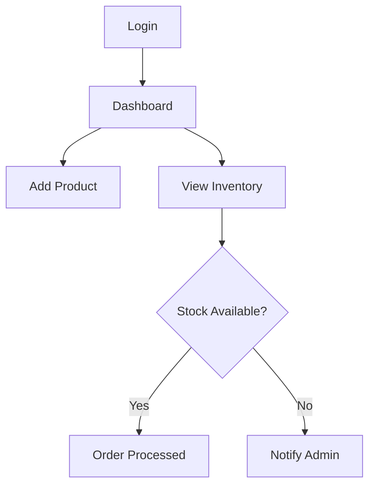

# Inventory Management System

This is a web-based inventory management system developed using Django.

## Features

- Add/edit/delete products
- Track stock levels
- Generate reports
- User authentication

## Project Flow

